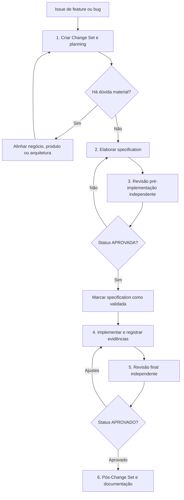

# Roteiro diário: de uma issue a uma Change Set concluída

Este guia descreve o fluxo operacional para iniciar uma implementação a partir de uma issue de feature ou bug. Ele mostra o que produzir, quem deve revisar cada etapa e quando o trabalho precisa voltar para uma fase anterior.

## Visão geral



A regra principal é: uma fase só avança quando produz evidência suficiente para a fase seguinte. Uma revisão com pendências retorna ao artefato responsável; ela não deve ser tratada como autorização informal para improvisar durante a implementação.

## 1. Receber a issue e criar o planning

Crie uma pasta `docs/change-sets/cs-[ID]/` e copie o modelo de [planning](../../templates/change-set/planning.md) para `planning-<titulo>.md`.

Registre:

- o problema, a oportunidade ou o defeito;
- as pessoas e áreas afetadas;
- o resultado esperado e o caso de uso;
- o que está fora do escopo conhecido;
- decisões, contribuições, dúvidas, riscos e validações necessárias.

Se uma dúvida puder mudar escopo, comportamento, segurança, dados ou experiência de uso, mantenha o planning como `em alinhamento`. Não crie uma especificação executável enquanto essa decisão não estiver resolvida.

O planning orienta a próxima etapa, mas não autoriza implementação.

## 2. Elaborar a specification

Use o modelo de [specification](../../templates/change-set/specification.md) e o prompt de [transformação de planning em specification](../../prompts/planning-to-specification.md).

Leia o planning e inspecione o projeto somente para confirmar caminhos, contratos, padrões e comandos existentes. A specification deve conter:

- escopo incluído, fora de escopo, contratos e compatibilidade;
- requisitos `RQ-*`, cada um com origem e comportamento verificável;
- itens `CI-*` de implementação associados aos requisitos;
- critérios de aceite `CA-*` associados aos requisitos;
- validações `VT-*` com procedimento literal e resultado esperado;
- matriz de rastreabilidade entre `RQ-*`, `CI-*`, `CA-*` e `VT-*`;
- mapa inicial de contexto, riscos e decisões pendentes.

O status deve ser `rascunho` enquanto houver bloqueio ou `pronta para revisão` quando o documento estiver completo. Não use `validada` nesta etapa.

## 3. Revisar a especificação antes de implementar

Abra uma sessão independente e use o modelo de [revisão pré-implementação](../../templates/change-set/review-specification.md) e o [prompt de revisão da specification](../../prompts/review-specification.md). Salve o resultado em `review-specification-<titulo>.md`.

A revisão deve conferir, no mínimo:

- fidelidade entre planning e specification;
- clareza de escopo e não escopo;
- decisões e riscos materiais;
- cobertura completa da matriz de rastreabilidade;
- critérios de aceite e comandos verificáveis;
- coerência entre mapa de contexto e arquivos existentes;
- necessidade de dividir parte do trabalho em Sub-Change Set.

Os resultados possíveis são:

- `APROVADA`: marque a specification como `validada` e siga para implementação;
- `AJUSTES OBRIGATÓRIOS`: corrija a specification e submeta-a novamente;
- `REPROVADA`: retorne ao planning, redefina a mudança ou divida o escopo.

Em uma nova revisão, preserve os IDs `ESP-*` anteriores e registre o reteste. Isso evita repetir a análise sem saber quais problemas já foram corrigidos.

## 4. Implementar com evidências

A sessão de implementação deve ler o planning, a specification aprovada, o gate prévio e o mapa inicial de contexto.

Durante a implementação:

1. execute os itens `CI-*` na ordem que fizer sentido;
2. atualize cada item somente depois de implementar e validar sua alteração;
3. execute cada `VT-*` aplicável;
4. preencha a matriz com evidência concreta e resultado obtido;
5. registre arquivos fora do mapa inicial, desvios e pendências;
6. não altere requisito, contrato ou critério de aceite silenciosamente.

Se aparecer uma necessidade material nova, pare e retorne ao planning ou à specification. Uma decisão tomada apenas na sessão de implementação deixa a revisão sem uma fonte confiável de intenção.

## 5. Revisar a implementação

Abra outra sessão independente e use o modelo de [revisão final](../../templates/change-set/review.md) para produzir `review-<titulo>.md`.

O revisor deve ler o planning, a specification, o gate prévio, o diff, as validações e a revisão final anterior, se existir. Para cada `RQ-*`, confira:

```text
RQ-* → CI-* → CA-* → VT-* → evidência obtida → conclusão da revisão
```

Audite também escopo, regressões, tratamento de erro, contratos, autorização, dados e observabilidade quando aplicáveis.

Os resultados possíveis são:

- `APROVADO`: não há ajuste pendente;
- `AJUSTES OBRIGATÓRIOS`: há correções necessárias, mas a mudança continua viável;
- `REPROVADO`: há defeito crítico, risco alto ou falha que impede a integração.

Achados devem receber IDs `REV-*`, instrução de correção, evidência, impacto e teste requerido. Em uma revisão posterior, preserve cada ID e registre a evidência do reteste.

## 6. Executar o pós-Change Set

Somente após `APROVADO`:

- confirme o diff final e o `git status`;
- aplique o commit conforme a política do projeto;
- atualize `docs/change-sets/index.md` e `docs/source-tree.md` quando existirem;
- confira links, caminhos, contadores, contratos e ausência de dados sensíveis;
- registre hashes, validações, documentos alterados e risco residual no pós-Change Set.

O procedimento está no modelo de [pós-Change Set](../../templates/change-set/post-change-set.md).

## Checklist rápido da pessoa responsável

Antes de encerrar uma sessão, verifique:

- [ ] sei qual é o status atual da Change Set;
- [ ] o próximo artefato está indicado por um link ou caminho real;
- [ ] não há dúvida material escondida como premissa;
- [ ] cada requisito possui trabalho, aceite, validação e evidência;
- [ ] toda pendência tem responsável e próximo passo;
- [ ] qualquer desvio está registrado e não foi introduzido silenciosamente.

## Regra de retorno

Uma revisão não é uma fila de pedidos soltos. O retorno deve acontecer no artefato que originou o problema:

| Problema encontrado | Retorno correto |
|---|---|
| Intenção, escopo ou decisão de negócio indefinidos | `planning-<titulo>.md` |
| Contrato, requisito, critério ou validação incompletos | `specification-<titulo>.md` |
| Implementação divergente ou teste insuficiente | sessão de implementação |
| Documentação final inconsistente com o diff aprovado | pós-Change Set |
